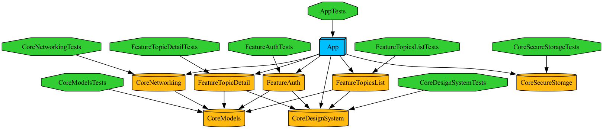

# Banking Tech Stack

A modular iOS banking-style app built with MVVM + Clean Architecture and Tuist, backed by a small Go server that makes the login, topics, and live ticker flows work end to end.

**The iOS app is the main part of this project. The backend is a lightweight support service** — just enough to give the app something real to talk to.

## iOS app

- Swift 6.0, iOS 26.0+
- Workspace generated with [Tuist](https://tuist.io/) — no third-party SPM dependencies
- Architecture: `View → ViewModel → UseCase → Repository (protocol)`, following MVVM + Clean Architecture

### Module structure

The dependency rule is strict: **Features depend on Core, never on each other.** `App` is the only module allowed to depend on more than one Feature — it composes them. See [ios/NOTES.md](ios/NOTES.md) for the full reasoning behind this and other architecture decisions.

| Module | Purpose |
|---|---|
| `App` | Composition root and dependency injection |
| `Features/Auth` | Login screen (`AuthView`, `AuthViewModel`, `LoginUseCase`) |
| `Features/TopicsList` | Topic list with search, plus the live ticker |
| `Features/TopicDetail` | Topic detail screen |
| `Core/Models` | Shared domain models and repository protocols |
| `Core/Networking` | HTTP client and repository implementations |
| `Core/SecureStorage` | Token and secret storage |
| `Core/DesignSystem` | Shared UI building blocks |



### Feature highlights

- Login screen wired to a real backend (`AuthView` / `AuthViewModel` / `LoginUseCase`)
- Topic list with search
- Live ticker built on a Combine publisher wrapped around a WebSocket connection (`URLSessionWebSocketTask`)
- Swift 6 strict concurrency in `Core` (`Sendable`, `@MainActor`)
- Two testing styles side by side: XCTest in `Core`, Swift Testing (`@Test`, `#expect`) in `Features` and `App`
- `MockURLProtocol` used to stub network calls in tests

### Running the app

```bash
cd ios
tuist generate --no-open
tuist build
tuist test
```

The backend must be running first — login, the topics list, and the live ticker all need it to work.

### Current status

Core flows (login, topics, live ticker) work end to end. Token storage is in place: the refresh token is persisted in the Keychain (`ThisDeviceOnly`, so it never leaves the device via backups), the access token is kept in memory only, and a biometry-gated store (Face ID / Touch ID) is ready for the `GET /secret` value. Token refresh is serialized through a single-flight `TokenRefreshCoordinator`, so concurrent 401s trigger exactly one refresh call. TLS certificate pinning is in place: one shared `URLSession` pins the server's SPKI (public key) hash for both HTTPS and the WebSocket ticker, failing closed on any mismatch. Some security hardening is still in progress: basic jailbreak/debugger checks are not finished yet.

## Backend

A small Go service whose only job is to give the iOS app something real to call — not a project in its own right.

- Go, standard library `net/http`, plus one dependency: `github.com/coder/websocket`
- Serves HTTPS on `:8443` with a self-signed certificate
- JWT authentication signed with ES256

### Endpoints

| Endpoint | Description |
|---|---|
| `GET /health` | Health check |
| `POST /auth/login` | Returns an access token and a refresh token |
| `POST /auth/refresh` | Returns a new access token |
| `GET /topics` | List of topics |
| `GET /topics/{id}` | Topic details |
| `GET /ws/ticker` | WebSocket feed used by the iOS live ticker |
| `GET /secret` | Example protected endpoint, requires a valid JWT |

### Running the backend

```bash
cd backend
./scripts/gen-cert.sh
go run ./cmd/server
```

## Repository layout

```
.
├── ios/        # iOS app (Tuist workspace, MVVM + Clean Architecture)
├── backend/    # Go server backing the app
└── certs/      # TLS certificate and key used by the backend (generated, not committed)
```
