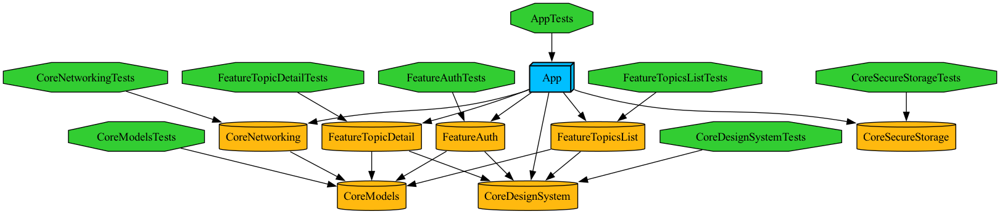

# Tuist notes — Day 2

Module dependency graph, generated with `tuist graph --format png --output-path .`:



## What Tuist gives beyond plain SPM

- **Project generation from a typed manifest.** `Project.swift` / `Workspace.swift` are Swift,
  type-checked, with autocomplete. SPM's `Package.swift` can describe modules too, but it wasn't
  designed to generate a full Xcode app project (build settings, schemes, Info.plist wiring) —
  Tuist generates a real `.xcworkspace`/`.xcodeproj` from the declared graph.
- **No `.xcodeproj` merge conflicts.** The generated project files are gitignored
  (`*.xcodeproj`, `*.xcworkspace`) and rebuilt with `tuist generate`. Nobody hand-edits a pbxproj,
  so there's nothing to merge-conflict on.
- **Binary module caching (`tuist cache`).** Content-hash-based binary substitution per target —
  if a module's sources and dependencies haven't changed, `tuist generate` can drop in a
  prebuilt binary instead of recompiling it. Plain SPM has no first-party equivalent for this;
  Xcode's own DerivedData caching isn't shareable across machines/CI the same way.
  Note: the shared/remote cache needs a (free-tier) Tuist account; local generation still
  benefits from cache substitution without one.
- **`tuist graph` as a live architecture check.** The diagram above is generated straight from
  the manifests — if a `Feature → Feature` edge is ever accidentally introduced, it becomes
  visible immediately, instead of hiding in a flat SPM package graph.

## Architecture decisions worth being able to defend

- **Dependency rule: `Features → Core` only, never `Feature → Feature`.** Enforced structurally —
  a Feature's `Project.swift` simply never lists another Feature as a dependency. `App` is the
  only module allowed to depend on more than one Feature; it composes them. This is the concrete
  answer to "how do you avoid a god module": the rule isn't a convention someone has to remember,
  it's what the manifests allow you to declare.
- **Repository protocols live in `Core/Models`, not per-feature `Domain/` folders.** Textbook
  Dependency Inversion would put the protocol next to the feature that uses it. But the module
  rule (`Features → Core` only) means `Core/Networking` — the concrete implementer — can never
  depend on a Feature module to see its protocol. `Core/Models` is the one module both a Feature
  (consumer) and `Core/Networking` (implementer) already depend on, so that's where the contract
  has to live. `App` is what wires the concrete `Core/Networking` type into each Feature's use
  case at startup (see `CompositionRoot.swift`). Worth stating explicitly in an interview: it's a
  deliberate trade-off between "protocol next to its feature" and "module graph stays acyclic",
  not an oversight.
- **Deployment target: iOS 26.** No backward-compatibility need for a training project running
  on a personal Mac/simulator, so the target is set to whatever Xcode currently ships
  (Xcode 26.6) to use the newest APIs without `@available` gymnastics.
- **Swift 6 strict concurrency deliberately NOT enabled yet.** All 8 modules build today in
  default (Swift 5) language mode, no `Sendable`/`@MainActor` anywhere. That's scheduled for
  Day 3, once there's real async code to make correct — turning it on today would either force
  writing concurrency-aware code prematurely on empty stubs, or do nothing observable. Keeping it
  off now sets up a clean "before/after" diff to talk through on Day 3.
- **Test framework split by layer, not random.** `Core/*` test targets use XCTest,
  `Features/*` and `App` use Swift Testing (`@Test`/`#expect`). This is set up now so Day 6's
  planned XCTest-vs-Swift-Testing comparison has two real, pre-existing examples instead of one
  built for the occasion.

## Certificate pinning: SPKI over leaf cert, and how to rotate

### What we pin

The pin is `base64(SHA-256(DER SubjectPublicKeyInfo))` — a hash of the server's *public key
structure*, not of the certificate. It is the same value that openssl produces:

```bash
openssl x509 -in server.crt -pubkey -noout \
  | openssl pkey -pubin -outform der | openssl dgst -sha256 -binary | base64
```

`ios/scripts/spki-pin.sh` wraps this (`--cert`, `--host`, `--key` modes), and
`backend/scripts/gen-cert.sh` prints the pin every time it regenerates the local certificate.
Pins live per environment in `Core/Networking/Sources/Pinning/PinningConfiguration.swift`,
next to the base URLs. The delegate (`PinningURLSessionDelegate`) handles the server-trust
challenge for one shared `URLSession` built in `CompositionRoot` — the same session carries
HTTPS and the WSS ticker, so all traffic is pinned in one place.

### Why SPKI, not the leaf certificate

- **Certificates are rotating metadata; the key is the identity.** A leaf certificate is
  reissued regularly (Let's Encrypt every 90 days, and the CA/Browser Forum is pushing maximum
  validity down toward ~47 days). Pinning the certificate would force an app release for every
  renewal. The private/public key pair can stay the same across renewals — an SPKI pin
  survives them.
- **Same security, less brittleness.** What the pin actually protects is "the server proved it
  holds this private key". The certificate around that key adds nothing to the pin's security,
  only more reasons to break.
- **Chain-wide matching adds operational freedom.** The delegate accepts a match against *any*
  certificate in the validated chain, so ops can pin an intermediate CA key instead of the
  leaf and decouple app releases from server certificate changes completely.
- **It is the industry standard.** HPKP (RFC 7469), TrustKit, and OkHttp all pin SPKI hashes.

Two implementation details worth defending in an interview:

- **The ASN.1 header dance.** `SecKeyCopyExternalRepresentation` returns the raw key *without*
  the SubjectPublicKeyInfo header, so `SPKIHash` prepends the fixed DER header for the key
  type before hashing — otherwise the hash would never match an openssl-computed pin. Only
  EC P-256 and RSA-2048 headers are supported; an unknown key type hashes to `nil` and can
  never match a pin (fail closed). The allowlist doubles as a key policy.
- **Pinning narrows trust, never widens it.** `SecTrustEvaluateWithError` (chain, hostname,
  expiry) runs first; the pin check happens only after the system says yes. A pin can never
  make an otherwise invalid certificate acceptable. (For `.local`, DEBUG builds anchor the
  self-signed certificate to itself so hostname/expiry checks still run; that code path is
  compiled out of Release. Apple's TLS policy also demands the `serverAuth` extended key
  usage and ≤398-day validity, which is why `gen-cert.sh` sets those.)

### How to rotate pins

- **Always ship at least two pins.** The live server key, plus a *backup* key generated
  offline and kept cold. `spki-pin.sh --key` computes a pin straight from a key file, so the
  backup certificate does not need to exist yet.
- **Planned rotation (overlap, zero downtime):**
  1. Generate the new key pair; compute its pin (`spki-pin.sh --key new.key`).
  2. Ship an app release whose pin set is {current, new, backup}.
  3. When that release's adoption is high enough, switch the server to the new key.
  4. In the next release, drop the old pin and promote a fresh backup.
  The server only changes keys between app releases that both trust it.
- **Emergency rotation (key compromised or lost):** switch the server to the backup key
  immediately — every shipped build already trusts it — then run the planned flow to
  establish a new backup.
- **Failure mode is loud but safe.** A pin mismatch cancels the TLS handshake before any
  request byte is sent; the app surfaces `NetworkError.pinningFailure` (the delegate records
  the failed host, because URLSession reports the cancel as a generic "cancelled" error).
  There is deliberately no remote kill switch — a bad rotation bricks networking for affected
  builds until an app update, which is exactly why the backup pin is mandatory.
- **Local dev:** rerunning `backend/scripts/gen-cert.sh` prints the new pin; paste it into
  the `.local` entry in `PinningConfiguration.swift`.

## Basic RASP checks: debugger and jailbreak detection, and their limits

### What we check

`Core/RASP` (`CoreRASP`) exposes two independent signals through `RASPCheck.currentStatus()`:

- **Debugger attached** (`DebuggerCheck`): the classic `sysctl(KERN_PROC, KERN_PROC_PID, pid)`
  call from Apple Technical Q&A QA1361, checking the `P_TRACED` bit in `kinfo_proc.kp_proc.p_flag`.
- **Likely jailbroken** (`JailbreakCheck`): looks for files that jailbreak tooling leaves behind
  (`/Applications/Cydia.app`, `/Library/MobileSubstrate/MobileSubstrate.dylib`, and similar), and
  tries to write a file under `/private` — something a correctly sandboxed app can never do.

`CompositionRoot` runs both once at launch (`BankingTechStackApp.init` calls
`checkRASPStatusAtLaunch()`) and only logs a warning if either fires. Nothing blocks on the
result — no login gate, no forced logout, no UI change.

### Why sysctl / file-heuristics, not a third-party RASP SDK

- **No third-party SPM dependencies in this workspace** (see the module table in `CLAUDE.md`) —
  the same constraint that led to hand-rolling certificate pinning applies here.
- **These are meant to be simple, auditable trip-wires**, not a bypass-proof anti-tampering
  product. A real RASP SDK adds obfuscation and anti-hooking around its own checks; a from-scratch
  `sysctl` call and a handful of `fileExists` checks make no such claim, and the code says so.

### Limitations (read this before trusting a `true`/`false`)

- **Both checks are bypassable on a jailbroken device.** A jailbreak tweak can hook
  `JailbreakCheck`'s file checks to always report "clean," or patch the `sysctl` result. Neither
  check defends against an attacker who controls the runtime — they only catch an
  unsophisticated one.
- **Detect-only, not prevent.** There is no API to stop a debugger from attaching or a jailbreak
  from existing; these checks only observe state at the moment they run.
- **Defense-in-depth, never the sole gate.** Do not wire either flag into an authorization
  decision (e.g. "block login if jailbroken") without accepting that a jailbroken device can
  simply forge a `false`. Treat a positive result as one signal to log/monitor, alongside
  certificate pinning and normal server-side validation — never as a trusted client-side fact.
- **`isLikelyJailbroken` reports `true` on the iOS Simulator — this is expected.** The Simulator
  runs as a normal process on the macOS host, so paths like `/bin/bash` and `/usr/sbin/sshd`
  (absent on a stock, non-jailbroken iOS device, which is exactly why they're on the suspicious
  list) trivially exist there, and `/private` is writable too. Don't read a Simulator run as a
  false alarm or as evidence the check is broken; verify jailbreak behavior on a real device.

## Commands used

```bash
tuist generate --no-open   # regenerate the workspace after any manifest change
tuist build                # build every module + the app in dependency order
tuist test                 # run all 9 test targets
tuist graph --format png --output-path .   # this file's diagram
```
